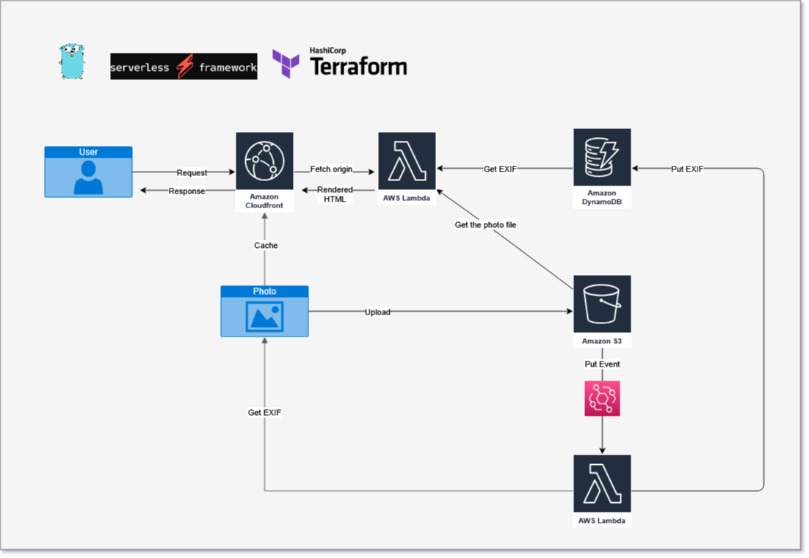

# lambda-image-viewer

A simple image viewer using AWS Lambda + CloudFront + DynamoDB + S3.

## Features

### CDN

- Provides a typical S3-backed CDN via CloudFront.

### Image Viewer


- Shows an image info (EXIF).

### Camera Roll (Admin Page)


- You can list all uploaded images.

## Structure



- No ALB or API Gateway. The viewer uses Lambda Function URLs.
- S3-event-driven Tagger gets EXIF by a photo and puts to DynamoDB.


## Requirements

- Serverless Framework v3.34
- Terraform v1.5.0
- Go 1.21
- AWS

You can also use **env to install easily.

- [tsubasaogawa/slsenv](https://github.com/tsubasaogawa/slsenv)
- [tfutils/tfenv](https://github.com/tfutils/tfenv)
- [go-nv/goenv](https://github.com/go-nv/goenv)

## Usage

### Clone

```bash
git clone https://github.com/tsubasaogawa/lambda-image-viewer.git
```

### Deploy Lambda

```bash
cd src/viewer

# Fix environments. Please follow comments in .env file.
cp -p .env.tmpl .env
vim .env

# Building go binary, deploying lambda
serverless deploy

# Show the deploy information.
serverless info
```

### Deploy Infrastructure

```bash
cd ../../terraform

# Fix environments.
cp -p terraform.tfvars.tmpl terraform.tfvars
vim terraform.tfvars

terraform init
terraform apply

# Deploy Lambda again to set some environment variables using Secrets Manager created by Terraform.
cd ../src/viewer
serverless deploy
```

### Upload photo

```bash
aws s3 cp <PHOTO FILE> s3://<CREATED S3 BUCKET>/<FILE NAME>
```

## Future Works

- Fix design
