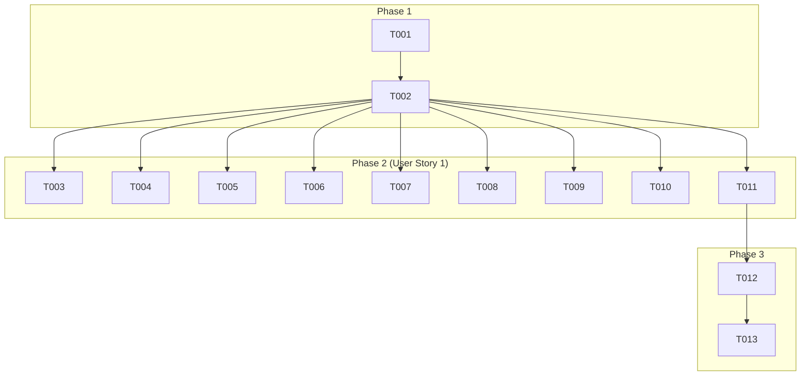

# Implementation Tasks: Spec-kit Setup

**Branch**: `001-spec-kit-setup` | **Spec**: [spec.md](spec.md) | **Plan**: [plan.md](plan.md)

## Phase 1: Setup

- [x] T001 プロジェクトルートに `.gemini` ディレクトリを作成する
- [x] T002 `.gemini` ディレクトリ内に `commands` ディレクトリを作成する

## Phase 2: User Story 1 - Spec-kit初期設定

**Goal**: ユーザーは、spec-kitをプロジェクトに導入し、必要な初期設定ファイルを自動生成することで、spec-kitの運用を開始できる。
**Independent Test**: `spec-kit setup`コマンドを実行し、`.gemini` ディレクトリと必要な設定ファイルがすべて正しく生成されることを確認する。

### Implementation Tasks

- [x] T003 [P] [US1] `.gemini/config.yaml` ファイルを生成する
- [x] T004 [P] [US1] `.gemini/commands/speckit.analyze.toml` ファイルを生成する
- [x] T005 [P] [US1] `.gemini/commands/speckit.checklist.toml` ファイルを生成する
- [x] T006 [P] [US1] `.gemini/commands/speckit.clarify.toml` ファイルを生成する
- [x] T007 [P] [US1] `.gemini/commands/speckit.constitution.toml` ファイルを生成する
- [x] T008 [P] [US1] `.gemini/commands/speckit.implement.toml` ファイルを生成する
- [x] T009 [P] [US1] `.gemini/commands/speckit.plan.toml` ファイルを生成する
- [x] T010 [P] [US1] `.gemini/commands/speckit.specify.toml` ファイルを生成する
- [x] T011 [P] [US1] `.gemini/commands/speckit.tasks.toml` ファイルを生成する

## Phase 3: Polish & Cross-Cutting Concerns

- [x] T012 生成されたすべてのファイルが、それぞれのテンプレートに基づいた正しい内容を持っていることを確認する
- [x] T013 `.gitignore` に `.gemini/` が含まれていないことを確認し、含まれている場合は削除する

## Dependencies

## Parallel Execution

- **User Story 1**: タスク T003 から T011 は、`commands` ディレクトリが作成された後であれば、すべて並行して実行可能です。これにより、ファイル生成プロセスを大幅に高速化できます。

## Implementation Strategy

- **MVP (Minimum Viable Product)**: User Story 1のすべてのタスクを完了させることがMVPとなります。これにより、ユーザーはspec-kitの基本的な設定を完了し、すぐに利用を開始できます。
- **Incremental Delivery**: この機能は単一のユーザーストーリーで構成されているため、すべてのタスクを一度にデリバリーします。
