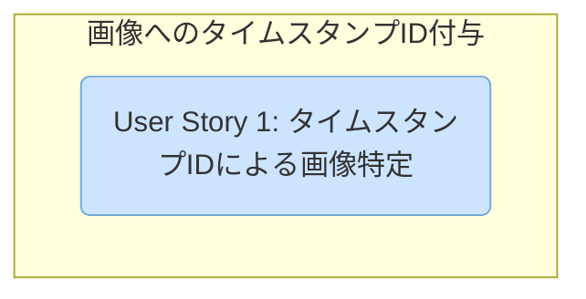

# Actionable Tasks: 画像へのタイムスタンプID付与

**Feature**: `002-image-timestamp-id`
**Generated**: 2025-11-12
**Design Docs**: [plan.md](./plan.md), [spec.md](./spec.md), [research.md](./research.md), [quickstart.md](./quickstart.md)

## Phase 1: Setup

*このフェーズでは、プロジェクトの初期設定や、すべてのユーザーストーリーに共通する基盤を構築します。*

- [x] T001 既存のテストを確認し、テンプレートのレンダリングを検証するテストケースを特定する `src/viewer/cmd/viewer/viewer_test.go`

## Phase 2: User Story 1 - タイムスタンプIDによる画像特定

*Goal: Camera Rollページの各画像に、タイムスタンプを`id`として持つ`
`タグを付与する。*
*Independent Test: ページを検証し、各画像にタイムスタンプIDを持つ`
`タグがあることを確認できる。*

- [x] T002 [US1] `camera_roll.html.tmpl`を更新し、`
`に`id="{{.Timestamp}}"`を追加する `src/viewer/cmd/viewer/templates/camera_roll.html.tmpl`
- [x] T003 [US1] テンプレートのレンダリングテストに、`id`属性が正しく設定されることを検証するアサーションを追加する `src/viewer/cmd/viewer/viewer_test.go`

## Dependencies

*ユーザーストーリー間の依存関係と、推奨される完了順序を記述します。*

**Completion Order**:
1.  **User Story 1**: ユーザーストーリーは1つのみで、依存関係はありません。

## Parallel Execution

*各ユーザーストーリー内で並行して実行可能なタスクの例を示します。*

- **User Story 1**:
  - このユーザーストーリーのタスクは直線的であり、並列実行の機会はありません。

## Implementation Strategy

- **MVP (Minimum Viable Product)**: User Story 1を完了させることがMVPとなります。
- **Incremental Delivery**: この機能は単一のユーザーストーリーで構成されているため、一度のデプロイで完了します。
